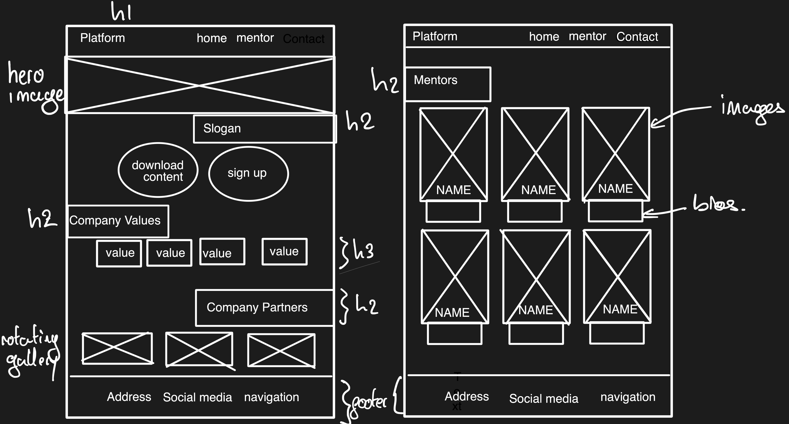
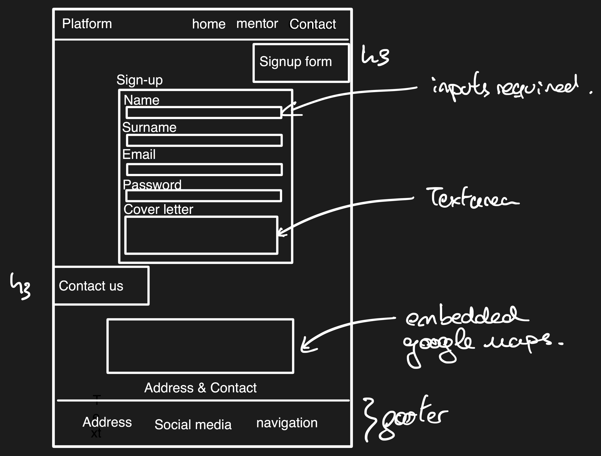
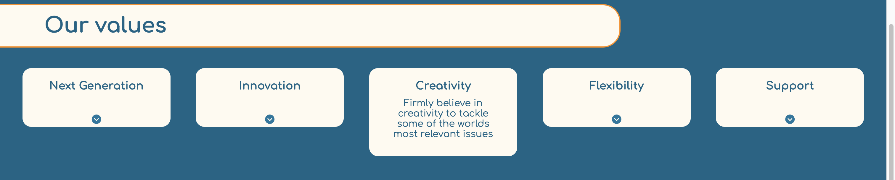
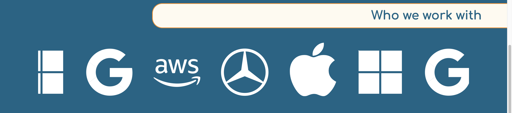
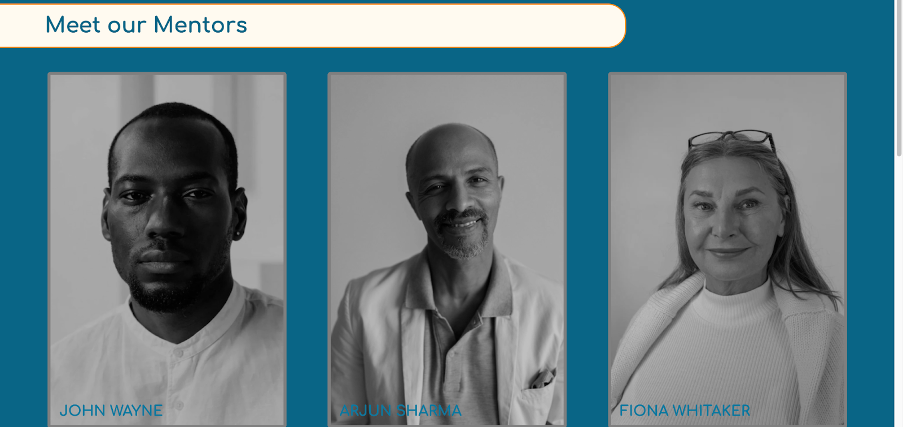
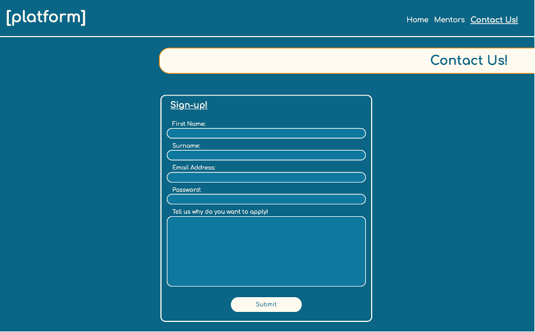
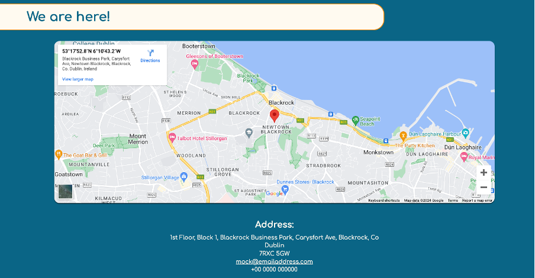
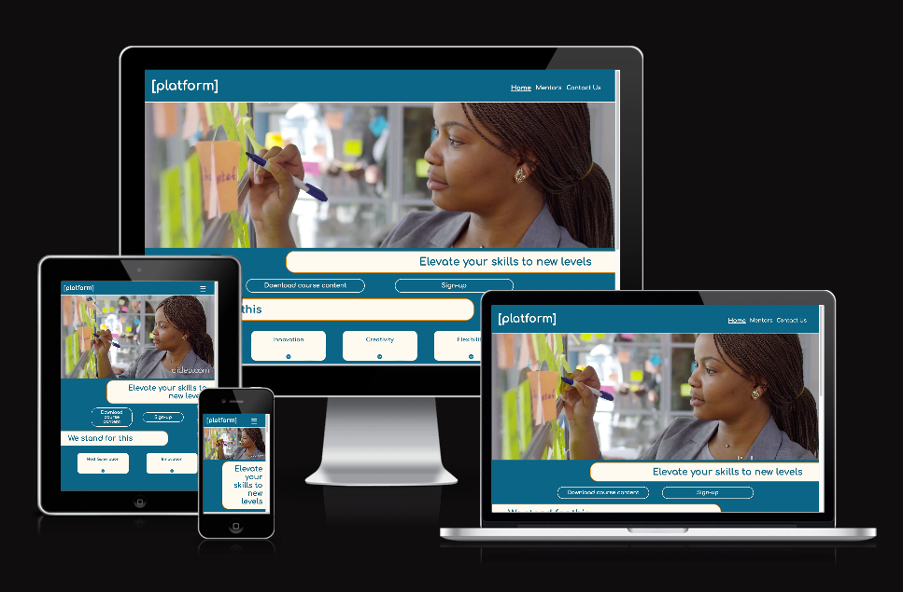

# Platform README.md

Link to live website: (https://rodrivazquezasenjo.github.io/PP1---Platform/)

## **Overview**
Platform is a website produced as a deliverable for the Code Institute Full Stack Development Software Diploma course. It presents a mentoring services company and highlights knowledge on HTML5, CSS and UI/UX design. 

The company offers a mentoring course with a number of different mentors
to adjust to the mentees requirements. Users will come to this website
and view a modern and clean aesthetic which aims to represent an
avant-garde philosophy by the mentoring company. The desired user will be an early-career professional, who speaks english. The user will be able to access downloadable content, check the address of the company and view values and partners with who the mentoring services company works with.

## Table of Contents.

1. [Overview](#overview)
2. [User Experience](#user-experience)
3. [Technologies Used](#technologies-used)
4. [Testing](#testing)
5. [Deployment](#deployment)
6. [Credits](#credits)
7. [Acknowledgements](#acknowledgements)
8. [Contact Information](#contact-information)

## User Experience

To describe the User Experience design process of the website, the 5 planes of UX design will be discussed below. 

### **1. Strategy Plane**

At this level thep project objectives and aspirations, and the users
serving those objectives are identified.

- **Product Objective**: To create a platform where potential users will be attracted to sign up to the mentorship program.

- **User Needs**:

  - **Client:** To transmit in a clear and concise idea the company image, and to provide a way for the potential mentees to sign up to the program.

  - **Customer:** To be able to find all the information required to make an informed decision on signing up to the mentorship.

- **Business Objectives**: To attract customers, and increase uptake of customers.

#### **User Stories:**

- **Client Story \#1:** To create a modern website which displays the identity and values of the company.

  - **<u>Acceptance:</u>** The website will be dynamic and modern in aesthetics, it’ll include values and collaborators to provide a sense of identity and magnitude.

- **Client Story \#2:** To quickly direct viewers to signing up for the course.

  - **<u>Acceptance:</u>** The website will have numerous links to the sign up section, including a link on the landing page.

- **Customer Story \#1:** I want to be able to quickly view the course program so that I can see if I’m interested in signing up for the course.

  - **<u>Acceptance:</u>** The website will include a link on the landing page to view the course program.

- **Customer Story \#2:** I want to view the different mentors I can apply including their area of expertise, a profile picture and a short bio.

  - **<u>Acceptance:</u>** The website will include a section only on the mentors.

### **2. Scope Plane**

Once the strategy is set and the abstract objectives have been defined,
we can contextualize this in the Scope Plane. The objectives will be
reviewed into clear goals, which will be fulfilled by a list of features
the website will need to follow.

#### **Features**

The website will have three different pages which will be accessible at
any point from any of the pages, you’ll land on the home page which will
include course information and a link to the sign up form. It will also
include partners the company regularly interacts with and values which
they stand for. The second page will be solely on the information
regarding the different mentors available, while the third page will
have the sign up form, and the contact information.

### **3. Structure Plane**

On the structure plane, the ways in which the user navigates the website
are defined, where will the user land, what will be his options from
where he lands and further on.

As the user accesses the website, he’ll be landing on the home page,
where he will be greeted by a hero image clearly portraying a sense of
professional development. Here, he’ll notice the navigation bar at the
top, present in all pages, which will be able to take him to a mentor
page and a signup page, and just below the image he’ll find two buttons
supported by a slogan which will give them the option to download the
course program and to sign up.

If the user decides to scroll down the website, they will view the values
the company stands by and the companies that \[platform\] is involved
with. At the bottom of the website, there will be a footer with
important information replicating in every page. This footer will
include the address where the company can be found, any social media
links and further navigation tools.

If the user decides to instead click on either of the links at the top
of the website, they will be redirected to the mentors or sign up form.

The mentors webpage will have display in a minimalistic view the
different mentors available together with a short description and their
name. The sign up page will have a form requesting contact information
from the user together with a text box where the applicant can state
what his intentions are with the course to be best matched with a
mentor. This site will also have contact information.

### **4. Skeleton Plane**

At the skeleton plane the layout of the website is designed. Wireframes can be used for this:

### **5. Surface Plane**

The surface plane is concerned with the visual aspects of the specific
features of the site. Below is each one listed with the design
principles alongside.

Font used: Comfortaa.

Color scheme used:

- Main Color: #086586

- Supplementary Color: floralwhite

- Secondary Color: #0e789f

- Highlights Color: darkorange

- Shadows Color: #031f29

Font used: Comfortaa from google fonts (https://fonts.google.com/share?selection.family=Comfortaa:wght@300..700)

Feature \#1: Navigation Bar

The navigation bar will be present in every page. It will show the logo
at the top left and the navigation options on the top right. All of
these features will be animated when hovered over in a similar fashion,
scaling up and changing color to the highlights color. Additionally, the current site will be indicated by an underline on the respective link.

It is worth noting that in resolutions smaller than 768px, the
navigation bar links will be collapsed into a burger menu.

Feature \#2: Hero Image

The landing Image is displayed across the entire width.

Feature \#3: Propaganda section buttons and slogan.

The website maintains a consistent presentation across the pages,
enveloping the headers into a off-white rounded boxes. Buttons will have
rounded edges, and be animated on hovering and on selecting. This will
be done by scaling up and changing the color distribution.

Feature \#4: Values section.

On the values section, there will be a number of cards which pull down
on hovering and reveal the description for each of the values.

Feature \#5: Partners section.

On the partners section, a scrolling gallery has been added, showing
with more dynamicity and interest the logos of the companies
\[platform\] is involved
with.

Feature \#6: Footer section.
The footer section shows the address of the company, the social media
links and a further navigation link option. Each of the elements will be
scaled and change color when hovered over.

Feature \#7: Mentors section.

The mentors section shows clearly profile images of each of the mentors,
on a dimmed grayscale. When hovered over, the images will turn into
color and a bio including the relevant industry will pull down from each
of the cards.

Feature \#8: Signup section.

On the last page, the user will find the sign up form where the form
will require First Name, Surname, Email address, Password and an
application box where applicants can send out a brief cover letter on why they want
to join the mentorship program. Each of the items is animated
differently on hovering and on selecting. The submit button is also
animated.

Feature \#9: Embedded map section.

The contact information is found just below an interactive map of the
address of the institute. The user will be able to access the map when
clicked in, and will find the address and phone number and email
address.

### **Technologies Used**

This project has been completed using the following:

<u>Languages:</u>

- HTML5

- CSS

<u>Resources:</u>

- GitHub

- GitPod

- Google Fonts

- Pexels

- Font Awesome

- Code Beautify

- iOS Notes

- Prefixer

- Codepen

### **Testing**

Testing of this website has been done as follows:

1.  <u>Validators:</u>

- Google Lighthouse: Measures the performance, accessibility, best practices and SEO. Each of the sites were tested both in mobile and desktop. Accessibility, best practices and SEO were over 95 on every device. Performance was slightly lower on mobile devices due to large LCPs. Preloading and priority was added to the media which took a long time to load. These images were also compressed and changed to .webp format to reduce their size. While not ideal, the performance insight tab of google chrome highlighted that images were being rendered 0.25s after opening the website, therefore the large LCP is deemed as a residual risk. More appropriate imagery would be investigated at the next stage of design to ensure the performance metric sits above 90.

- [HTML Validator](https://validator.w3.org/): Checks for any errors in the HTML code. After running for index.html, mentor.html and contact.html no errors were found. A warning was highlighted where a section didn't have a header, however a div is used instead as recommended. 

- [CSS Validator](https://jigsaw.w3.org/css-validator/): Checks for any errors in the CSS code. After running for style.css no errors were found. 

2.  <u>Browser compatibility:</u>

- Chrome: Pass

- Safari / Edge: Pass

- Firefox: Pass

3.  <u>Functionality</u>

<table>
<colgroup>
<col style="width: 9%" />
<col style="width: 20%" />
<col style="width: 28%" />
<col style="width: 26%" />
<col style="width: 15%" />
</colgroup>
<thead>
<tr class="header">
<th>Test ID</th>
<th>Test Label</th>
<th>Test Action</th>
<th>Expected Outcome</th>
<th>Test Outcome</th>
</tr>
<tr class="odd">
<th>T01</th>
<th>Nav bar hovering</th>
<th>Hovering over the nav bar links, and the logo.</th>
<th>The logo and the links should scale up and turn orange when hovered
over. The bottom border should turn orange when the header is hovered
over.</th>
<th>Pass</th>
</tr>
<tr class="header">
<th>T02</th>
<th>Nav bar links</th>
<th>Clicking the logo and the navigation menu items</th>
<th>The platform logo on the top left should direct the user to the home
page, the home item should direct the user to the home page, the mentor
item should direct the user to the mentor page, the contact us item
should direct the user to the sign up and contact page.</th>
<th>Pass</th>
</tr>
<tr class="odd">
<th>T03</th>
<th>Responsive nav bar</th>
<th>Reducing the width of the viewport to test the responsiveness of the
website.</th>
<th>Below 768px the nav bar will collapse into a burger menu logo which
drops down the menu items when checked. Pass 768px the nav bar will
display all its items horizontally along the top of the page in a fixed
position</th>
<th>Pass</th>
</tr>
<tr class="header">
<th>T04</th>
<th>Hero Image</th>
<th>Adjust the width of the screen</th>
<th>The image should not overflow and autoadjust to the screen width. /th>
<th>Pass</th>
</tr>
<tr class="odd">
<th>T05</th>
<th>Propaganda buttons</th>
<th>Clicking on the buttons</th>
<th>
The “download course content” button scales up and changes the
color scheme when hovered over. It changes color scheme one further time
when actioned. Once clicked, a pdf should download.

The “sign-up” button scales up and changes the color scheme when
hovered over. It changes one further time when clicked and actioned.
Once clicked, the button should direct you to the sign up form in the
Contact page
</th>
<th>Pass</th>
</tr>
<tr class="header">
<th>T06</th>
<th>Propaganda buttons responsiveness</th>
<th>Adjusting the width of the device.</th>
<th>The buttons will stay central in all widths, adjusting the height of
the box.</th>
<th>Pass</th>
</tr>
<tr class="odd">
<th>T07</th>
<th>Values cards animations</th>
<th>Hovering over the values cards</th>
<th>The values card will one by one pull down an extra height of the box
which will include a short description of its title.</th>
<th>Pass</th>
</tr>
<tr class="header">
<th>T08</th>
<th>Values cards responsiveness</th>
<th>Adjusting the width of the device.</th>
<th>As the width narrows the cards will retain the same item width and
occupy the most available horizontal space, wrapping below when there is
not enough.</th>
<th>Pass</th>
</tr>
<tr class="odd">
<th>T09</th>
<th>Gallery autoscrolling</th>
<th>Observe gallery</th>
<th>The gallery will automatically scroll in a carousel infinitely.</th>
<th>Pass</th>
</tr>
<tr class="header">
<th>T10</th>
<th>Footer animations</th>
<th>Hover over the footer items</th>
<th>The footer items will scale up and change to orange as they’re
hovered over in all pages.</th>
<th>Pass</th>
</tr>
<tr class="odd">
<th>T11</th>
<th>Footer links</th>
<th>Click the different items of the footer</th>
<th>
The address div will take you to the sign up form and address
when clicked on.

Each of the social media logos will take you to their respective
social media when clicked.

The nav links at the bottom right will take you to its respective
pages.
</th>
<th>Pass</th>
</tr>
<tr class="header">
<th>T12</th>
<th>Footer responsiveness</th>
<th>Adjust the width of the viewport.</th>
<th>Each of the divs (address, social media, navigation) will respond to
the width available occupying the maximum available horizontal width,
when this is not available they will wrap below.</th>
<th>Pass</th>
</tr>
<tr class="odd">
<th>T13</th>
<th>Mentor Cards animations</th>
<th>Hover over the mentor cards.</th>
<th>The mentor cards will change from grayscale to color when hovered
over, the border will change colors, the card will scale up and a
description will pull down.</th>
<th>Pass</th>
</tr>
<tr class="header">
<th>T14</th>
<th>Mentor cards responsiveness</th>
<th>Adjust the width of the viewport.</th>
<th>The mentor cards will respond to the width available occupying the
maximum available horizontal width, when this is not available they will
wrap below.</th>
<th>Pass</th>
</tr>
<tr class="odd">
<th>T15</th>
<th>Sign-up form animations</th>
<th>Hover over the sign up form and click each of the items.</th>
<th>
When hovered over the sign up form will scale up and change to a
lighter blue.

When hovered over, the outline of the text inputs and their labels
will turn orange. When clicked in, the background color of the input box
will change to white, and the box and the label will scale up.

The button will also scale up when hovered over, and will change
color scheme. It will further change its color scheme when
pressed.
</th>
<th>Pass</th>
</tr>
<tr class="header">
<th>T16</th>
<th>Sign up form button link</th>
<th>Press the button</th>
<th>
When pressed, apart from the change in color scheme, a form will
be sent to the following link: <a
href="https://formdump.codeinstitute.net/"><u>https://formdump.codeinstitute.net/</u></a>.

The fields of first_name, surname, email, password and coverletter
will be filled.
</th>
<th>Pass</th>
</tr>
<tr class="odd">
<th>T17</th>
<th>Sign up form required fields</th>
<th>Press the button without filling up the fields</th>
<th>The form will not be sent until all the fields have been
appropriately filled, including the email which will require a @ and a .
and th password will not show the characters when the field is
unselected.</th>
<th>Pass</th>
</tr>
<tr class="header">
<th>T18</th>
<th>Interactive map animation</th>
<th>Hover over the map</th>
<th>The map will scale up when hovered over.</th>
<th>Pass</th>
</tr>
<tr class="odd">
<th>T19</th>
<th>Email in the address section of the contact us page</th>
<th>Click the email</th>
<th>The email should redirect you to gmail when pressed on.</th>
<th>Pass.</th>
</tr>
</thead>
<tbody>
</tbody>
</table>

4.  <u>Responsiveness</u>

The site adheres as intended on every device. 

5. <u>Fixed bugs</u>

#### Logo Flickering in Safari
While the image wasn't captured, the logo on the top left of the website glitched on safari. The glitch involved happened when hovering over the logo, as the logo would flicker. It originally was meant to change colors to darkorange and to increase in size. In order to fix this, prefixes were added through prefixer: (https://autoprefixer.github.io/). Additionally, I changed the dimension format from % to rem on every font size and used transform: scale() for the increase in size. This solved the issue.

6. <u>Unfixed bugs</u>

#### Menu bar text too large on Firefox
When testing the website on Firefox, the navigation menu when collapsed into the burger menu has the text larger than any other browser. While it doesn't impede legibility, further padding would be appropriate to have a less cluttered navigation bar. Unfortunately, this bug can't be fixed in time for the submission of the projet. However, the strategy to solve it would be to understand the inheritance of paddings and widths in case Firefox reads them differently to Chrome and should this not be the case either a media query or smaller font-size would be specified. 

## **Deployment**

Deployment of this website has been done through the repository found in
GitHub.
([<u>https://github.com/RodriVazquezAsenjo/PP1---Platform</u>](https://github.com/RodriVazquezAsenjo/PP1---Platform))

Once in this link, click on the settings tab on the top navigation bar.

After, click on the pages tab on the left-hand menu under the code and
automation section.

Here, under the “Build and Deployment” on the “Source” drop-down menu,
select “Deploy from a branch”.

Next, select “Main” on the “Branch” drop-down menu, and ensure the
folder is set to /(root) and save.

This will automatically deploy your site, for confirmation, ensure that
a new section on the pages section shows up which states that the site
is live.

**Git Clone**

Git cloning is essentially creating a copy of an existing code from a
remote repository to your local repository. It is a key tool that allows
collaboration between developers when producing a code and also allows
for individuals to use an existing code as a baseline. When cloning a
code, the associated files, commit history, branches and tags when
downloaded to your local machine.

To clone a code you’ll need to follow these steps:

1.  Download the chrome extension for GitPod which can be found [<u>here</u>](https://chromewebstore.google.com/detail/gitpod/dodmmooeoklaejobgleioelladacbeki) and more information can be found [<u>here</u>](https://www.gitpod.io/docs/introduction).

2.  Restart your browser.

3.  Navigate to your desired Project Repository.

4.  On the top right corner a GitPod button should be seen. If pressed, it will take you to the GitPod workspace and open up a copy of the project repository you wish.

It is worth noting that any pushes intended to be done to the original
code will request approval from the author of the original code.

**Git Fork**

An alternative to cloning, which maintains a relationship to the
original repository, is forking. With forking you create a copy of a
repository to your own account on Github. This means that the two
repositories (original and forked) are now independent and the user is
free to make any changes to the repository.

To create a fork, follow these steps:

1.  Navigate to your desired repository.

2.  Click on the fork button on the top-right corner, above the GitPod button.

3.  Once forked, click on the GitPod Button.

## **Credits**

### Content:

ChatGPT4.0 has been used to create the downloadable course content .pdf
and the bios for the mentor cards. Any other content has been written by
the developer.

### Imagery:

Images have been obtained from pexels.

### Code:

Pull down animations have been based on example code from Codepen, link
[<u>here</u>](https://codepen.io/keubibo/pen/yLXYVOK). Created by Tuan,
August 28th 2021.

Scrolling gallery has been inspired by youtube content by Online
Tutorials, in the video “Infinite Scrolling Animation | CSS Only Text
and Image Carousel” uploaded
[<u>here</u>](https://www.youtube.com/watch?v=2l99ERCnB9c&ab_channel=OnlineTutorials)
on the 17th October 2023.

## **Acknowledgements**

Many thanks to my mentor Brian Macharia whose advice in coding has been
instrumental to the development of this website.

## **Contact Information**

- **Lead Designer:** Rodrigo Vázquez Asenjo
